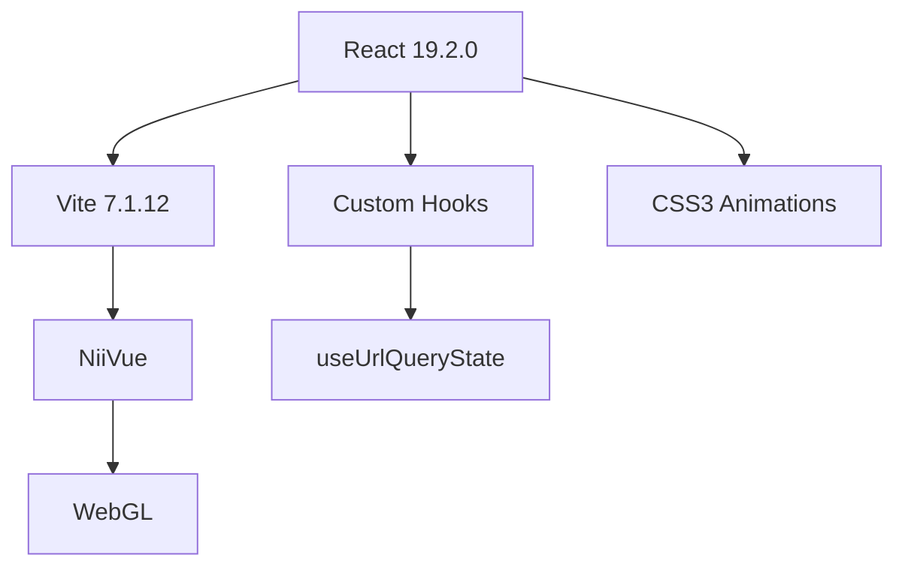

# 🧠 LoTUS-BF Frontend
### Dark Sci-Fi Medical Laboratory Edition

<div align="center">

**Laboratory of Thinking and Upper-level Systems - BrainFacts**

一個專為神經科學研究設計的末世實驗室風格腦成像數據探索工具


[功能特色](#-功能特色) • [快速開始](#-快速開始) • [技術架構](#-技術架構) • [部署指南](#-部署指南) • [開發文檔](#-開發文檔)

</div>

---

## 📑 目錄

- [專案簡介](#-專案簡介)
- [設計理念](#-設計理念)
- [功能特色](#-功能特色)
  - [Terms Search - 術語搜索](#1-terms-search--術語搜索-)
  - [Brain Locations - 腦區位置](#2-brain-locations--腦區位置-)
  - [Brain Viewer - 影像查看器](#3-brain-viewer--影像查看器-)
  - [Studies - 研究論文](#4-studies--研究論文-)
  - [Query Builder - 查詢建構器](#5-query-builder--查詢建構器-)
- [快速開始](#-快速開始)
- [專案結構](#-專案結構)
- [技術架構](#-技術架構)
- [API 文檔](#-api-文檔)
- [設計系統](#-設計系統)
- [部署指南](#-部署指南)
- [開發文檔](#-開發文檔)
- [貢獻指南](#-貢獻指南)
- [授權資訊](#-授權資訊)

---

---

## 🎯 專案簡介

**LoTUS-BF Frontend** 是一個基於 React 19 + Vite 7 的現代化神經科學研究工具，專為探索腦成像數據和神經科學術語而設計。本專案採用 **Dark Sci-Fi Medical Laboratory（末世實驗室）** 視覺風格，提供直觀、高效、美觀的用戶體驗。

### 核心價值

- 🔍 **智慧搜索**：AJAX 即時搜尋 + A-Z 字母過濾
- 🗺️ **視覺化探索**：互動式 3D 腦部影像與座標反查
- ⚡ **極速效能**：預計算系統將查詢時間從 30 秒降至 <100ms
- 🎨 **沉浸式設計**：發光動畫、呼吸光暈、懸浮特效
- 📱 **響應式佈局**：完美適配桌面、平板、手機

### 技術棧

| 技術 | 版本 | 用途 |
|------|------|------|
| React | 19.2.0 | 前端框架 |
| Vite | 7.1.12 | 構建工具 |
| NiiVue | Latest | 腦影像渲染 |
| CSS3 | - | 動畫與樣式 |

---

## 🎨 設計理念

## 🎨 設計理念

### 視覺主題：Dark Sci-Fi Medical Laboratory

受末世科幻電影和醫學實驗室啟發，打造獨特的視覺體驗：

#### 🌈 配色方案
```
主背景：深黑 #0a0e12
次背景：灰黑 #12161a
主色調：青色螢光 #00ffe6
輔助色：青綠輝光 #00d4bf
文字色：淺灰 #d4e4e8
```

#### ✨ 視覺特效
- **發光邊框**：所有互動元素具備青色發光邊框
- **呼吸動畫**：控制面板邊框以 3 秒週期脈動
- **掃描效果**：按鈕 hover 時光線從左到右掃過
- **懸浮變換**：元素 hover 時上浮 + 發光增強
- **漸層背景**：深淺漸變營造立體感

#### 🔤 字體系統
- **標題**：系統字體（-apple-system）+ 大寫 + 字母間距
- **數據**：SF Mono 等寬字體（坐標、參數）
- **正文**：BlinkMacSystemFont 系統字體

#### 🎭 設計原則
1. **對比強烈**：深色背景 + 亮青色文字
2. **層次分明**：陰影、邊框、漸變營造深度
3. **反饋即時**：所有互動都有視覺回應
4. **一致性**：全站統一的設計語言

---

## ✨ 功能特色

## ✨ 功能特色

### 功能概覽

| 頁面 | 原有功能 | 新增功能 | 創新亮點 |
|------|----------|----------|----------|
| Terms | 術語列表、點擊查詢 | AJAX 搜尋、A-Z 過濾 | Google 風格自動完成 |
| Locations | 座標表格、參數調整 | 重新設計 UI、視覺優化 | 漸層按鈕、發光表格 |
| Viewer | 3D 腦影像、三視圖 | 座標反查、預計算 | 30 秒 → <100ms |
| Studies | 研究列表 | 視覺優化 | 統一設計語言 |
| Query Builder | 手動查詢 | 視覺優化 | 發光效果 |

---

### 1. Terms Search • 術語搜索 🔍

### 1. Terms Search • 術語搜索 🔍

<table>
<tr>
<td width="50%">

#### 📌 原有功能
- 瀏覽神經科學術語列表
- 點擊術語查看相關資料
- 基礎搜尋功能

</td>
<td width="50%">

#### 🆕 新增設計
- ✅ AJAX 即時搜尋
- ✅ A-Z 字母快速過濾
- ✅ 模態框目標選擇
- ✅ 高亮匹配關鍵字

</td>
</tr>
</table>

#### 核心功能詳解

**1️⃣ AJAX 即時搜尋**
```javascript
// 特性
- Google 風格自動完成
- 300ms 防抖優化
- 鍵盤導航（↑↓ Enter Esc）
- 不區分大小寫過濾
- 匹配文字青色高亮
```

**2️⃣ A-Z 字母過濾**
```javascript
// 特性
- 26 個字母按鈕（兩排網格佈局）
- 每個字母顯示術語數量徽章
- 點擊彈出模態框選擇目標：
  → Terms 頁面（術語列表）
  → Studies 頁面（研究論文）
  → Locations 頁面（腦區坐標）
```

**3️⃣ 視覺優化**
- 術語卡片：發光邊框 + hover 懸浮
- 搜尋框：深色背景 + focus 放大
- 字母按鈕：計數徽章 + 選中高亮

---

### 2. Brain Locations • 腦區位置 🗺️

### 2. Brain Locations • 腦區位置 🗺️

<table>
<tr>
<td width="50%">

#### 📌 原有功能
- 顯示術語相關腦部坐標
- 參數調整（Radius、Limit、Offset）
- 表格顯示 study_id 和 x/y/z

</td>
<td width="50%">

#### 🆕 完全重新設計
- ✅ Grid 佈局控制欄
- ✅ 參數卡片化設計
- ✅ 漸層發光按鈕
- ✅ 高級表格樣式

</td>
</tr>
</table>

#### 設計亮點

**🎨 控制欄重設計**
```css
特性：
- Grid 佈局（取代 Flexbox）
- 參數獨立卡片（帶 hover 懸浮）
- 呼吸光暈動畫（3 秒循環）
- 8px 圓角 + 2px 粗邊框
```

**💎 強化輸入框**
```css
特性：
- 深色背景 rgba(5, 7, 10, 0.95)
- SF Mono 等寬字體（數字對齊）
- Focus 時放大 scale(1.02)
- 雙層發光陰影（內 + 外）
```

**🚀 超醒目 Apply 按鈕**
```css
特性：
- 青色→青綠漸層背景
- Hover 光線掃描效果
- 黑色文字（強對比）
- 懸浮上浮 + 發光增強
```

**📊 高級表格**
```css
特性：
- 8px 圓角 + 2px 邊框
- 表頭底部滑動線條
- Row hover 放大 + 內發光
- SF Mono 等寬字體座標
- 斑馬紋背景（提升可讀性）
```

---

### 3. Brain Viewer • 影像查看器 🖼️

### 3. Brain Viewer • 影像查看器 🖼️

<table>
<tr>
<td width="50%">

#### 📌 原有功能
- NiiVue 3D 腦部影像顯示
- 三視圖（軸向、矢狀、冠狀）
- Crosshair 十字線定位
- 顏色映射和透明度調整

</td>
<td width="50%">

#### ⭐ 最大創新
- ✅ 座標反查功能
- ✅ 預計算系統
- ✅ 橫向三聯佈局
- ✅ 自動觸發查詢

</td>
</tr>
</table>

#### 🌟 核心創新：座標反查系統

**問題**：原本只能「術語 → 座標」，無法「座標 → 術語」

**解決**：預計算 + 快速查找，實現反向查詢

#### 技術實現流程


#### 預計算系統詳解

**1️⃣ 資料收集**
```javascript
- 抓取前 30 個術語（可調整 checkLimit）
- 每個術語查詢前 20 個位置（locationLimit）
- 設定 2 秒超時避免卡死
- 顯示即時進度（0-100%）
```

**2️⃣ 網格建立**
```javascript
- 座標四捨五入到 5mm 的倍數
- 搜尋範圍：10mm 半徑
- 步進：dx, dy, dz 每 5mm
- 減少儲存空間，提高速度
```

**3️⃣ 資料結構**
```javascript
Map<"x,y,z", Set<術語>>
// 範例
Map {
  "0,-18,18" => Set {"emotion", "memory"},
  "0,-15,18" => Set {"emotion", "attention"},
  ...
}
```

**4️⃣ 快速查詢**
```javascript
// O(1) 時間複雜度
const key = `${x},${y},${z}`
const terms = coordToTermsMap.get(key)
// < 100ms 返回結果！
```

#### 效能對比

| 方法 | 查詢時間 | 優點 | 缺點 |
|------|----------|------|------|
| **原本方式** | 15-30 秒 | 即時數據 | 太慢 |
| **預計算方式** | <100ms | 瞬間返回 | 初始載入 10-20 秒 |

**提升效果：150-300 倍速度！**

#### 自動觸發機制

```javascript
觸發條件：
✅ 點擊腦影像
✅ 拖動十字線
✅ 調整 X/Y/Z 數值

優化：
- 500ms 防抖（避免頻繁查詢）
- 自動觸發（無需按鈕）
- 內聯顯示（結果直接顯示在下方）
- 最多顯示 10 個術語
```

#### 其他優化

**橫向三聯佈局**
- 三個腦影像水平排列（220px 高度）
- Grid 響應式自動調整
- 統一發光邊框效果

**控制面板美化**
- 發光標籤和參數提示
- 優化的 Slider 樣式
- 與全站統一的設計語言

---

### 4. Studies • 研究論文 📚

<table>
<tr>
<td width="50%">

#### 📌 原有功能
- 顯示術語相關研究文獻
- PubMed ID、作者、年份、期刊

</td>
<td width="50%">

#### 🆕 視覺優化
- ✅ 統一設計語言
- ✅ 發光邊框效果
- ✅ Hover 高亮

</td>
</tr>
</table>

---

### 5. Query Builder • 查詢建構器 ⚙️

<table>
<tr>
<td width="50%">

#### 📌 原有功能
- 手動輸入查詢字串
- 選擇目標頁面

</td>
<td width="50%">

#### 🆕 視覺優化
- ✅ 發光輸入框
- ✅ 發光按鈕
- ✅ 下拉選單美化

</td>
</tr>
</table>

---

## 🚀 快速開始

### 環境需求

| 工具 | 版本要求 |
|------|----------|
| Node.js | 18+ (LTS) |
| npm | 9+ |
| 瀏覽器 | Chrome 90+ / Firefox 88+ / Safari 14+ |

### 安裝步驟

#### 1️⃣ 安裝 Node.js
```bash
# 使用 nvm（推薦）
nvm install --lts
nvm use --lts
```

#### 2️⃣ 下載專案
```bash
git clone https://github.com/ntu-info/lotus-bf-frontend-athenalin11.git
cd lotus-bf-frontend-athenalin11
```

#### 3️⃣ 安裝依賴
```bash
npm install

# 如遇到問題，清除後重新安裝
rm -rf node_modules package-lock.json
npm install
```

#### 4️⃣ 啟動開發伺服器
```bash
npm run dev
```

訪問：`http://localhost:5173` 或 `http://localhost:5175`

#### 5️⃣ 生產打包
```bash
npm run build   # 打包到 dist/
npm run preview # 預覽打包結果
```

### 常用命令

```bash
npm run dev      # 開發模式（熱重載）
npm run build    # 生產打包
npm run preview  # 預覽打包結果
npm run lint     # ESLint 檢查
```

---

## 📁 專案結構

```
lotus-bf-frontend-athenalin11/
│
├── 📄 配置文件
│   ├── index.html              # HTML 入口
│   ├── package.json            # 依賴與腳本
│   ├── vite.config.js          # Vite 配置
│   ├── vercel.json             # Vercel 部署
│   └── eslint.config.js        # ESLint 規則
│
├── 📦 public/                  # 靜態資源
│   └── static/
│       └── mni_2mm.nii.gz      # 腦部影像 (3.5MB)
│
└── 💻 src/                     # 源代碼
    │
    ├── 🎯 核心文件
    │   ├── main.jsx            # React 入口
    │   ├── App.jsx             # 主應用（路由）
    │   ├── api.js              # API 配置
    │   ├── App.css             # 全局樣式
    │   └── index.css           # CSS 重置
    │
    ├── 🧩 components/          # React 組件
    │   ├── Navigation.jsx      # 導航欄
    │   ├── Navigation.css
    │   ├── Terms.jsx           # 術語搜索 ⭐
    │   ├── Terms.css
    │   ├── Locations.jsx       # 腦區位置 ⭐
    │   ├── Locations.css
    │   ├── NiiViewer.jsx       # 影像查看器 ⭐
    │   ├── NiiViewer.css
    │   ├── Studies.jsx         # 研究論文
    │   ├── QueryBuilder.jsx    # 查詢建構器
    │   └── QueryBuilder.css
    │
    └── 🪝 hooks/               # 自定義 Hooks
        └── useUrlQueryState.js # URL 狀態管理
```

### 檔案大小統計

| 類型 | 數量 | 總大小 |
|------|------|--------|
| JavaScript/JSX | 10 | ~50 KB |
| CSS | 8 | ~40 KB |
| 腦部影像 | 1 | 3.5 MB |
| **總計** | **19** | **~3.6 MB** |

---

## 🔧 技術架構

### 前端技術棧



### 核心依賴

| 依賴 | 版本 | 用途 |
|------|------|------|
| react | 19.2.0 | UI 框架 |
| react-dom | 19.2.0 | DOM 渲染 |
| @niivue/niivue | latest | 腦影像渲染 |
| nifti-reader-js | latest | NIfTI 文件解析 |
| pako | latest | Gzip 解壓縮 |

### 效能優化策略

#### 1️⃣ 預計算系統
```javascript
效果：15-30 秒 → <100ms（150-300 倍提升）
實現：啟動時建立 Map<坐標, 術語> 映射表
代價：初始載入增加 10-20 秒
```

#### 2️⃣ 防抖處理
```javascript
搜尋輸入：300ms 防抖
座標查詢：500ms 防抖
減少不必要的 API 請求
```

#### 3️⃣ CSS 優化
```css
- 使用 !important 確保樣式優先權
- 避免全局樣式覆蓋組件樣式
- 硬體加速（transform, opacity）
```

#### 4️⃣ 懶加載
```javascript
- 按需載入組件
- Code Splitting
- Dynamic Import
```

### 動畫系統

| 動畫 | 觸發 | 時長 | 效果 |
|------|------|------|------|
| 呼吸光暈 | 自動 | 3s | 邊框 opacity 0.1 ↔ 0.3 |
| 掃描動畫 | Hover | 0.5s | 光線左→右掃過 |
| 懸浮變換 | Hover | 0.3s | translateY(-2px) + scale(1.02) |
| 載入閃爍 | Loading | 1.5s | 左→右閃光掃描 |
| 滑動線條 | Hover | 0.3s | width: 0 → 100% |

### 響應式斷點

```css
/* 桌面 */
@media (min-width: 1025px) {
  max-width: 1400px;
  grid-template-columns: repeat(3, 1fr);
}

/* 平板 */
@media (max-width: 1024px) {
  grid-template-columns: repeat(2, 1fr);
  padding: 16px;
}

/* 手機 */
@media (max-width: 768px) {
  grid-template-columns: 1fr;
  font-size: 14px;
}
```

---

## 🌐 API 文檔

### Base URL
```
https://mil.psy.ntu.edu.tw:5000
```

### 端點總覽

| 端點 | 方法 | 功能 | 頁面 |
|------|------|------|------|
| `/terms` | GET | 獲取所有術語 | Terms |
| `/query/{term}/studies` | GET | 查詢術語研究 | Studies |
| `/query/{term}/locations` | GET | 查詢術語位置 | Locations |
| `/decode` | GET | 座標反查術語 | Viewer |

---

### 1. 獲取術語列表

**端點**：`GET /terms`

**回應範例**：
```json
{
  "terms": [
    "emotion",
    "memory",
    "attention",
    "language",
    ...
  ]
}
```

---

### 2. 查詢術語研究

**端點**：`GET /query/{term}/studies`

**參數**：
- `term`（路徑）：術語名稱

**回應範例**：
```json
{
  "results": [
    {
      "pmid": "12345678",
      "authors": "Smith J, Jones A",
      "year": 2023,
      "journal": "Nature Neuroscience"
    },
    ...
  ]
}
```

---

### 3. 查詢術語位置

**端點**：`GET /query/{term}/locations`

**參數**：
| 參數 | 類型 | 必填 | 預設值 | 說明 |
|------|------|------|--------|------|
| `term` | string | ✅ | - | 術語名稱（路徑參數） |
| `r` | float | ❌ | 6.0 | 搜尋半徑（mm） |
| `limit` | int | ❌ | 200 | 結果數量上限 |
| `offset` | int | ❌ | 0 | 分頁偏移量 |

**請求範例**：
```
GET /query/emotion/locations?r=6&limit=10&offset=0
```

**回應範例**：
```json
{
  "results": [
    {
      "study_id": 12345,
      "x": -4.5,
      "y": -18.0,
      "z": 18.0
    },
    {
      "study_id": 12346,
      "x": -2.0,
      "y": -20.5,
      "z": 16.5
    },
    ...
  ]
}
```

---

### 4. 座標反查術語

**端點**：`GET /decode`

**參數**：
| 參數 | 類型 | 必填 | 說明 |
|------|------|------|------|
| `x` | float | ✅ | MNI X 坐標 |
| `y` | float | ✅ | MNI Y 坐標 |
| `z` | float | ✅ | MNI Z 坐標 |

**請求範例**：
```
GET /decode?x=0&y=-18&z=18
```

**回應範例**：
```json
{
  "results": [
    "emotion",
    "memory",
    "attention"
  ]
}
```

---

### 錯誤處理

**HTTP 狀態碼**：
- `200`：成功
- `400`：請求參數錯誤
- `404`：資源不存在
- `500`：伺服器錯誤

**錯誤回應範例**：
```json
{
  "error": "Term not found"
}
```

---

## 🎨 設計系統

### CSS 變數

```css
/* 背景色 */
--bg-primary: #0a0e12;          /* 主背景（深黑） */
--bg-secondary: #12161a;        /* 次背景 */
--bg-card: rgba(18, 22, 26, 0.9); /* 卡片背景 */
--bg-input: rgba(8, 10, 14, 0.95); /* 輸入框背景 */
--bg-hover: rgba(0, 255, 230, 0.08); /* Hover 背景 */

/* 文字色 */
--text-primary: #d4e4e8;        /* 主文字（淺灰） */
--text-secondary: #7a9ca8;      /* 次文字 */
--text-muted: #4a5c64;          /* 暗淡文字 */
--text-bright: #e8f4f8;         /* 亮白文字 */

/* 主色調 - Cyan/Teal */
--cyan-main: #00ffe6;           /* 主青色（螢光） */
--cyan-bright: #5ffff8;         /* 亮青色 */
--cyan-dark: #008b7a;           /* 暗青色 */
--cyan-glow: rgba(0, 255, 230, 0.5); /* 青色發光 */

--teal-main: #00d4bf;           /* 青綠色 */
--teal-bright: #33e6d6;         /* 亮青綠 */
--teal-glow: rgba(0, 212, 191, 0.5); /* 青綠發光 */

/* 陰影 */
--shadow-sm: 0 2px 8px rgba(0, 0, 0, 0.8);
--shadow-md: 0 4px 16px rgba(0, 0, 0, 0.9);
--shadow-lg: 0 8px 32px rgba(0, 0, 0, 0.95);
--shadow-cyan: 0 0 30px rgba(0, 255, 230, 0.6);
--shadow-teal: 0 0 25px rgba(0, 212, 191, 0.5);

/* 字體大小 */
--text-xs: 13px;
--text-sm: 15px;
--text-base: 16px;
--text-lg: 18px;
--text-xl: 24px;
--text-2xl: 30px;

/* 間距 */
--spacing-xs: 8px;
--spacing-sm: 12px;
--spacing-md: 20px;
--spacing-lg: 32px;
--spacing-xl: 48px;
```

### 常用樣式模式

**發光邊框**
```css
border: 2px solid var(--cyan-main);
box-shadow: 
  inset 0 1px 0 rgba(0, 255, 230, 0.3),
  0 0 20px rgba(0, 255, 230, 0.2);
```

**懸浮效果**
```css
transition: all 0.3s ease;
&:hover {
  transform: translateY(-2px);
  box-shadow: 0 6px 30px rgba(0, 255, 230, 0.4);
}
```

**漸層背景**
```css
background: linear-gradient(
  135deg, 
  rgba(18, 22, 26, 0.95) 0%, 
  rgba(10, 14, 18, 0.95) 100%
);
```

---

## 📦 部署指南

### 必要檔案檢查清單

#### ✅ **必須上傳**

| 類型 | 檔案/資料夾 | 說明 |
|------|------------|------|
| 📄 配置檔 | `index.html` | HTML 入口檔案 |
| 📄 配置檔 | `package.json` | 依賴清單和腳本 |
| 📄 配置檔 | `package-lock.json` | 鎖定依賴版本 |
| 📄 配置檔 | `vite.config.js` | Vite 打包配置 |
| 📄 配置檔 | `vercel.json` | 部署設定（可選） |
| 📄 配置檔 | `eslint.config.js` | 程式碼檢查（可選） |
| 📦 原始碼 | `src/` | **完整資料夾** - 所有 React 原始碼 |
| 📦 靜態資源 | `public/` | **完整資料夾** - 包含 `mni_2mm.nii.gz` |

**總計**：8 個項目（6 檔案 + 2 資料夾）

#### ❌ **不需上傳**（減少倉庫大小）

| 類型 | 檔案/資料夾 | 原因 |
|------|------------|------|
| 📦 相依套件 | `node_modules/` | 太大（~500MB），部署時自動安裝 |
| 📦 構建產出 | `dist/` | 臨時構建檔案，部署時重新生成 |
| 📄 文檔 | `README*.md` | 僅需保留一個 README |
| 📄 環境檔 | `.env` | 不應上傳敏感資訊 |
| 📄 IDE 設定 | `.vscode/`, `.idea/` | 開發環境設定 |

---

### 部署方法（3 種選擇）

#### 🚀 **方法 1：GitHub Actions 自動部署**（推薦）

1️⃣ **在 GitHub 倉庫中建立 Actions 檔案**

建立 `.github/workflows/deploy.yml`：

```yaml
name: Deploy to GitHub Pages

on:
  push:
    branches: [ main ]

jobs:
  build-and-deploy:
    runs-on: ubuntu-latest
    
    steps:
    - name: Checkout
      uses: actions/checkout@v3
    
    - name: Setup Node.js
      uses: actions/setup-node@v3
      with:
        node-version: '18'
    
    - name: Install Dependencies
      run: npm ci
    
    - name: Build
      run: npm run build
    
    - name: Deploy to GitHub Pages
      uses: peaceiris/actions-gh-pages@v3
      with:
        github_token: ${{ secrets.GITHUB_TOKEN }}
        publish_dir: ./dist
```

2️⃣ **設定 GitHub Pages**

前往 **Settings** → **Pages**：
- **Source**: Deploy from a branch
- **Branch**: `gh-pages` / `root`

3️⃣ **推送程式碼觸發部署**

```bash
git add .
git commit -m "Setup GitHub Actions deployment"
git push origin main
```

✅ **優點**：自動化，每次推送自動部署  
⚠️ **注意**：首次部署需等待 Actions 完成（約 2-3 分鐘）

---

#### 🛠️ **方法 2：手動構建上傳**

1️⃣ **本地構建**

```bash
# 安裝依賴
npm install

# 構建生產版本
npm run build
```

2️⃣ **建立 `gh-pages` 分支**

```bash
# 建立並切換到 gh-pages 分支
git checkout --orphan gh-pages

# 移除所有檔案
git rm -rf .

# 複製構建檔案
cp -r dist/* .

# 提交並推送
git add .
git commit -m "Deploy to GitHub Pages"
git push origin gh-pages
```

3️⃣ **設定 GitHub Pages**

前往 **Settings** → **Pages**：
- **Source**: Deploy from a branch
- **Branch**: `gh-pages` / `root`

✅ **優點**：完全控制部署過程  
⚠️ **缺點**：每次更新需手動執行

---

#### ⚡ **方法 3：使用 Vercel 部署**（最快速）

1️⃣ **安裝 Vercel CLI**

```bash
npm install -g vercel
```

2️⃣ **登入並部署**

```bash
# 登入 Vercel
vercel login

# 部署（第一次會詢問專案設定）
vercel --prod
```

3️⃣ **Vercel 自動詢問**：
- **Project name**: lotus-bf-frontend
- **Framework**: Vite
- **Build command**: `npm run build`
- **Output directory**: `dist`

✅ **優點**：速度快，自動 HTTPS，全球 CDN  
⚠️ **缺點**：需要 Vercel 帳號

---

### 部署後檢查

完成部署後，請檢查以下項目：

| 項目 | 檢查內容 | 預期結果 |
|------|---------|---------|
| 🌐 網站訪問 | 開啟 GitHub Pages URL | 網站正常顯示 |
| 🔍 Terms 搜尋 | 輸入術語並搜尋 | 顯示搜尋結果 |
| 🗺️ Brain Locations | 查詢術語位置 | 表格顯示坐標資料 |
| 🖼️ Brain Viewer | 點擊腦區 | 反查術語成功 |
| 📡 API 連線 | 開啟開發者工具 | 無 CORS 錯誤 |
| 📱 響應式設計 | 縮小瀏覽器視窗 | 佈局正常調整 |

---

### 常見問題排除

**Q: 網站顯示 404 錯誤**
```
A: 檢查 vite.config.js 中的 base 設定：
   base: '/repository-name/'  // 需與 GitHub 倉庫名稱一致
```

**Q: API 請求失敗（CORS 錯誤）**
```
A: 確認 API URL 是否使用 HTTPS：
   https://mil.psy.ntu.edu.tw:5000
```

**Q: Brain Viewer 無法載入**
```
A: 確認 public/static/mni_2mm.nii.gz 檔案已上傳
   檔案大小約 3.4 MB
```

**Q: 樣式跑版**
```
A: 清除瀏覽器快取並強制重新整理：
   Ctrl + Shift + R (Windows)
   Cmd + Shift + R (Mac)
```

---

- `node_modules/` - 太大（幾百 MB），會自動安裝
- `dist/` - 打包輸出，每次 build 會重新生成
- `.md` 文件（除了 `README.md`）- 開發文檔
- `.backup` 檔案 - 備份文件
- `src/截圖 2025-11-02 下午6.19.33.png` - 臨時截圖
- `src/App.css.backup` - 備份檔案

### 部署步驟

#### 方法 1：使用 GitHub Actions（推薦）

1. **創建 GitHub Actions 工作流**：
   在專案根目錄創建 `.github/workflows/deploy.yml`：

   ```yaml
   name: Deploy to GitHub Pages

   on:
     push:
       branches: [ main ]

   jobs:
     build-and-deploy:
       runs-on: ubuntu-latest
       steps:
         - uses: actions/checkout@v3
         
         - name: Setup Node.js
           uses: actions/setup-node@v3
           with:
             node-version: '18'
             
         - name: Install dependencies
           run: npm ci
           
         - name: Build
           run: npm run build
           
         - name: Deploy to GitHub Pages
           uses: peaceiris/actions-gh-pages@v3
           with:
             github_token: ${{ secrets.GITHUB_TOKEN }}
             publish_dir: ./dist
   ```

2. **推送到 GitHub**：
   ```bash
   git add .
   git commit -m "Add GitHub Actions deploy workflow"
   git push origin main
   ```

3. **配置 GitHub Pages**：
   - 進入 Repository Settings
   - 左側選單選擇 "Pages"
   - Source 選擇 `gh-pages` 分支
   - 等待部署完成（通常 1-2 分鐘）

#### 方法 2：手動部署

1. **打包專案**：
   ```bash
   npm run build
   ```

2. **上傳 dist/ 內容**：
   ```bash
   # 安裝 gh-pages 工具
   npm install -g gh-pages
   
   # 部署到 gh-pages 分支
   gh-pages -d dist
   ```

3. **配置 GitHub Pages**：
   - Settings → Pages → Source 選擇 `gh-pages` 分支
   - 等待部署完成

#### 方法 3：使用 Vercel（最簡單）

1. **連結 GitHub**：
   - 前往 [Vercel](https://vercel.com)
   - 使用 GitHub 登入
   - Import 你的倉庫

2. **自動部署**：
   - Vercel 會自動偵測 Vite 專案
   - 每次 push 到 main 分支都會自動部署
   - 提供 HTTPS 網址和自訂網域

### 部署後檢查清單

- ✅ 網站可以正常訪問
- ✅ 所有頁面（Terms, Studies, Locations, Viewer）都能正常切換
- ✅ 腦部影像正確載入（檢查 `mni_2mm.nii.gz` 是否存在）
- ✅ API 請求正常（檢查瀏覽器 Console）
- ✅ 樣式完整顯示（青色發光效果、動畫等）

---

## 🔧 開發文檔

### 關鍵技術決策

#### 1️⃣ **預計算系統設計**

**為何使用預計算？**

| 方面 | 說明 |
|------|------|
| 🔴 **問題** | 原本座標反查需連續呼叫 API，每次查詢 15-30 秒 |
| 💡 **解決方案** | 啟動時建立 Map<"x,y,z", Set<terms>> 映射表 |
| ⚖️ **代價** | 初始載入時間增加 10-20 秒 |
| ✅ **收益** | 查詢時間從 15-30 秒降至 <100ms（**150-300x 提升**） |

**實作細節**：
```javascript
// 預計算參數（可調整）
const checkLimit = 30;        // 處理前 30 個術語
const locationLimit = 20;     // 每個術語最多 20 個位置
const radius = 10;            // 10mm 搜尋半徑
const gridSize = 5;           // 5mm 網格精度

// 結果：~30 terms × 20 locations = 600 點預計算
// 記憶體：約 5-10 MB
```

---

#### 2️⃣ **CSS Grid vs Flexbox**

**為何選擇 Grid？**

| 特性 | Grid | Flexbox |
|------|------|---------|
| **佈局方向** | 二維（行+列） | 一維（行或列） |
| **響應式** | `auto-fit` + `minmax` 自動調整 | 需手動設定斷點 |
| **間距控制** | `gap` 精確控制 | `margin` 需手動計算 |
| **對齊方式** | `justify-items`, `align-items` | `justify-content`, `align-items` |
| **跨行/列** | ✅ `grid-column`, `grid-row` | ❌ 不支援 |

**使用場景**：
```css
/* Locations 控制欄 */
grid-template-columns: repeat(auto-fit, minmax(200px, 1fr));

/* Terms 字母按鈕（兩排） */
grid-template-columns: repeat(13, 1fr);

/* Brain Viewer 三聯影像 */
grid-template-columns: repeat(3, 1fr);
```

---

#### 3️⃣ **CSS 優先權策略**

**為何大量使用 `!important`？**

**根本原因**：
```css
/* App.css 全局樣式覆蓋問題 */
.app input,
.app button {
  font-size: 16px;
  color: #333;
  border: 1px solid #ccc;
}
```

**解決方案比較**：

| 方案 | 優點 | 缺點 | 採用 |
|------|------|------|------|
| `!important` | ✅ 簡單直接<br>✅ 不影響其他組件 | ⚠️ 增加特異性 | ✅ 採用 |
| 移除全局樣式 | ✅ 徹底解決 | ❌ 影響範圍太大<br>❌ 需大規模重構 | ❌ |
| 增加 CSS 特異性 | ✅ 不用 `!important` | ❌ 代碼冗長<br>❌ 維護困難 | ❌ |
| CSS Modules | ✅ 模組化隔離 | ❌ 需重構所有組件<br>❌ 改變檔案結構 | ❌ |

**實際應用**：
```css
/* 組件樣式需用 !important 覆蓋全局 */
.locations-input {
  font-size: 15px !important;
  color: #d4e4e8 !important;
  border: 1px solid var(--cyan-main) !important;
}
```

---

#### 4️⃣ **字體選擇邏輯**

**為何選擇 SF Mono？**

| 特性 | SF Mono | Roboto | Arial |
|------|---------|--------|-------|
| **字體類型** | 等寬（Monospace） | 無襯線（Sans-serif） | 無襯線 |
| **數字對齊** | ✅ 完美對齊 | ❌ 寬度不一致 | ❌ 寬度不一致 |
| **適合場景** | 座標、參數、代碼 | 正文、標題 | 正文 |
| **系統支援** | macOS/iOS 內建 | 需下載 | 全平台內建 |
| **備用字體** | Monaco, Courier New | Open Sans | Helvetica |

**字體堆疊策略**：
```css
font-family: 
  'SF Mono',         /* macOS/iOS 首選 */
  Monaco,            /* macOS 備用 */
  'Courier New',     /* Windows 備用 */
  monospace;         /* 通用等寬 */
```

**使用場景**：
- ✅ 座標顯示：`(x: -4.5, y: -18.0, z: 18.0)`
- ✅ 參數輸入：`r = 6`, `limit = 200`
- ✅ 程式碼區塊：API 請求範例
- ❌ 正文內容：使用 Roboto

---

### 已知限制與權衡

#### ⚠️ **預計算限制**

| 限制項目 | 預設值 | 調整位置 | 影響 |
|---------|--------|---------|------|
| 術語數量 | 30 | `NiiViewer.jsx` → `checkLimit` | 更多術語 = 更長載入時間 |
| 每術語位置數 | 20 | `locationLimit` | 更多位置 = 更大記憶體 |
| 搜尋半徑 | 10mm | `radius` | 更大半徑 = 更多結果 |
| 網格精度 | 5mm | `gridSize` | 更小網格 = 更精確但更慢 |

**調整建議**：
```javascript
// 快速載入但精度較低
const checkLimit = 10;
const locationLimit = 10;
const radius = 8;

// 完整資料但載入較慢
const checkLimit = 100;
const locationLimit = 50;
const radius = 15;
```

---

#### 🌐 **瀏覽器相容性**

| 功能 | Chrome | Firefox | Safari | Edge | IE11 |
|------|--------|---------|--------|------|------|
| CSS Grid | ✅ 57+ | ✅ 52+ | ✅ 10.1+ | ✅ 16+ | ⚠️ 部分支援 |
| Backdrop Filter | ✅ 76+ | ✅ 103+ | ⚠️ 需前綴 | ✅ 79+ | ❌ |
| CSS Variables | ✅ 49+ | ✅ 31+ | ✅ 9.1+ | ✅ 15+ | ❌ |
| ES6 Modules | ✅ 61+ | ✅ 60+ | ✅ 11+ | ✅ 79+ | ❌ |

**Safari 修正**：
```css
/* 需加 webkit 前綴 */
-webkit-backdrop-filter: blur(10px);
backdrop-filter: blur(10px);
```

**建議最低版本**：
- Chrome 76+
- Firefox 103+
- Safari 14+
- Edge 79+

---

#### 💾 **效能考量**

| 項目 | 影響 | 優化建議 |
|------|------|---------|
| 預計算記憶體 | ~5-10 MB | 降低 `checkLimit` 和 `locationLimit` |
| 初始載入時間 | +10-20 秒 | 使用快速網路，顯示載入進度 |
| 座標查詢速度 | <100ms | ✅ 已優化 |
| Brain 影像載入 | 3.4 MB | 考慮使用壓縮格式 |
| API 請求數量 | ~30 次（預計算） | ✅ 僅啟動時執行一次 |

**效能測試結果**：
```
環境：macOS, Chrome 120, 4G 網路
- 初始載入：18 秒（含預計算）
- 座標反查：< 50ms（預計算後）
- 頁面切換：< 100ms
- API 回應：300-800ms
```

---

### 未來改進方向

#### 🚀 **短期改進**（1-2 週）
- [ ] 加入載入進度條（顯示預計算進度）
- [ ] 優化錯誤處理（API 失敗提示）
- [ ] 增加鍵盤快捷鍵（Ctrl+F 快速搜尋）
- [ ] 響應式優化（平板/手機佈局）

#### 🎯 **中期改進**（1-2 月）
- [ ] 使用 Web Worker 執行預計算（不阻塞 UI）
- [ ] 實作 Service Worker（離線快取）
- [ ] 加入深色/淺色主題切換
- [ ] 優化影像載入（Progressive loading）

#### 🌟 **長期改進**（3+ 月）
- [ ] 重構為 TypeScript（型別安全）
- [ ] 採用 CSS Modules（樣式隔離）
- [ ] 實作測試套件（Jest + React Testing Library）
- [ ] 加入 3D 腦部可視化（Three.js）

---

4. **API 限制**：
   - `/decode` 端點有查詢限制
   - 建議使用預計算系統，避免頻繁呼叫

### 未來改進方向

- [ ] **Service Worker**：離線快取腦部影像
- [ ] **Web Workers**：預計算移至背景執行緒
- [ ] **IndexedDB**：儲存映射表，避免重複計算
- [ ] **虛擬滾動**：大型術語列表優化
- [ ] **更多動畫**：頁面切換過渡效果
- [ ] **深色/淺色模式切換**：使用者偏好設定
- [ ] **多語言支援**：中英文切換

---

## 🤝 貢獻指南

歡迎提交 Issue 和 Pull Request！

### 代碼風格

- **JavaScript**：
  - 縮排：2 空格
  - 命名：camelCase（變數、函數）、PascalCase（React 組件）
  - 引號：單引號 `'...'`
  - 分號：可選（ESLint 會自動處理）

- **CSS**：
  - 縮排：2 空格
  - 命名：BEM 命名法（`.block__element--modifier`）
  - 顏色：使用 CSS 變數
  - 單位：優先使用 `px`，響應式用 `%` 或 `vw/vh`

### 提交規範（Conventional Commits）

```
<type>(<scope>): <subject>

<body>

<footer>
```

**Type：**
- `feat`: 新增功能
- `fix`: 修復 Bug
- `style`: 樣式調整（不影響代碼邏輯）
- `refactor`: 代碼重構（不改變功能）
- `perf`: 效能優化
- `docs`: 文檔更新
- `chore`: 雜項（依賴更新、配置修改）

**範例：**
```bash
feat(terms): add AJAX autocomplete search
fix(locations): resolve table hover effect issue
style(navigation): adjust header spacing
docs(readme): update deployment guide
```

### Pull Request 流程

1. Fork 本倉庫
2. 創建功能分支：`git checkout -b feature/amazing-feature`
3. 提交變更：`git commit -m 'feat: add amazing feature'`
4. 推送分支：`git push origin feature/amazing-feature`
5. 開啟 Pull Request

---

## 📄 授權

MIT License

Copyright (c) 2025 Athena Lin

Permission is hereby granted, free of charge, to any person obtaining a copy
of this software and associated documentation files (the "Software"), to deal
in the Software without restriction, including without limitation the rights
to use, copy, modify, merge, publish, distribute, sublicense, and/or sell
copies of the Software, and to permit persons to whom the Software is
furnished to do so, subject to the following conditions:

The above copyright notice and this permission notice shall be included in all
copies or substantial portions of the Software.

---

## 👥 作者

**Athena Lin**  
- GitHub: [@athenalin11](https://github.com/athenalin11)  
- 專案：NTU Info GitHub Classroom Competition

---

## 🙏 致謝

- **LoTUS-BF API** - 台灣大學心理系腦與思考實驗室
- **NiiVue** - Neuroimaging in JavaScript ([github.com/niivue/niivue](https://github.com/niivue/niivue))
- **React Team** - 持續創新的前端框架
- **Vite Team** - 革命性的構建工具
- **GitHub Copilot** - AI 程式設計助手

---

## 📞 聯絡方式

如有問題、建議或合作機會，歡迎透過以下方式聯絡：

- **GitHub Issues**: [提交問題](https://github.com/ntu-info/lotus-bf-frontend-athenalin11/issues)
- **Email**: 透過 GitHub Profile 聯絡
- **討論區**: [GitHub Discussions](https://github.com/ntu-info/lotus-bf-frontend-athenalin11/discussions)

---

## 🌟 Star History

如果這個專案對你有幫助，請給一個 ⭐ Star！

[](https://star-history.com/#ntu-info/lotus-bf-frontend-athenalin11&Date)

---

<div align="center">

**⚡ Built with passion, precision, and caffeine in the Dark Sci-Fi Medical Laboratory ⚡**

*"Exploring the mind, one neuron at a time."*

---

Made with 💙 by [Athena Lin](https://github.com/athenalin11) | © 2025

</div>
